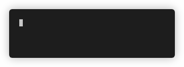

# echo "Hello, $(whoami)"
  
  
Welcome to my GitHub profile. My name is Davi, and I am a Computer Science student, a Linux enthusiast and a back-end developer.  
For programming and related tasks, I mostly use:  

> 

  

  
<!-- That FastAPI badge URL is insane -->
I also currently plan to study Rust.  
If you'd like to contact me, my email is available in my GitHub profile. Also, if you speak portuguese, check out my website at https://agst.dev